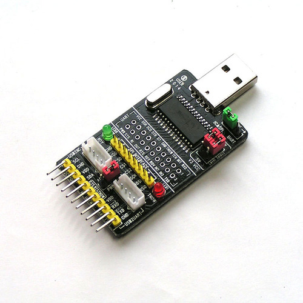

# ch341a-bitbang-userland

A simple blink a GPIO pin (CTS) of a CH341A via libusb.



# Blink

A simple gpio led blink example, using pin ```CTS```.

This is doing a 10000 loops with a 1 sec sleep between HIGH and LOW of the
GPIO pin labelled "CTS" on my CH341A USEN dongle "ALL IN ONE".

# Screenshot

```
$ ./ch341
OK, found device [4.03]
data: c1
data: c0
data: c1
data: c0
data: c1
data: c0
data: c1
data: c0
data: c1
^C
```

# Todo

* Document which values (gpio_dir_mask) for all the 6 GPIOs in HIGH or LOW

# Links

This project is heavily inspired by and uses parts from these projects:

* https://github.com/Trel725/chavrprog
* https://github.com/setarcos/ch341prog
* https://github.com/gschorcht/spi-ch341-usb
* https://github.com/gschorcht/i2c-ch341-usb
